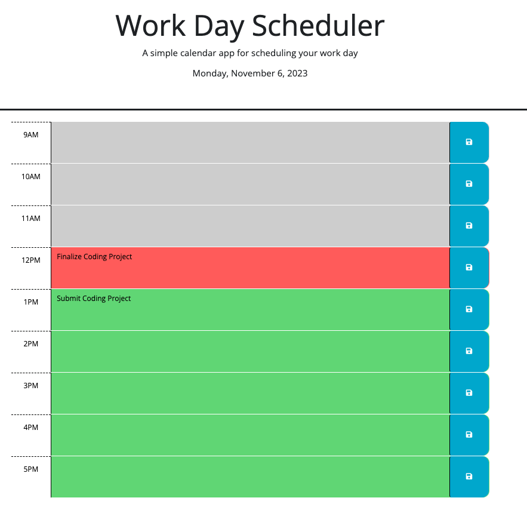

# 3rd Party APIs - Work-Day - Scheduler

## Description

The purpose of the application is to allow users to save events for each hour of a typical working day. It runs in the browser and has dynamically updated HTML and CSS powered by jQuery. Past hour timeblocks are gray, the current hour time block is red, and future hour time blocks are green.

My deployed application can be found [here](https://conartisttt.github.io/3rdPrtyAPIs-Work-Day-Scheduler/)

## Features

* Dynamically updated HTML & CSS, powered by jQuery
* Timer to update current date using Day.js Library
* Use of localStorage to persist schedule

The following screenshot demonstrates the applications functionality:

## Technologies Used

* HTML
* CSS
* JavaScript
* Jquery
* Day.js

## Credits

* Starter code provided by edX Boot Camps LLC.
* All updates made by Conner Martin aka Conartisttt